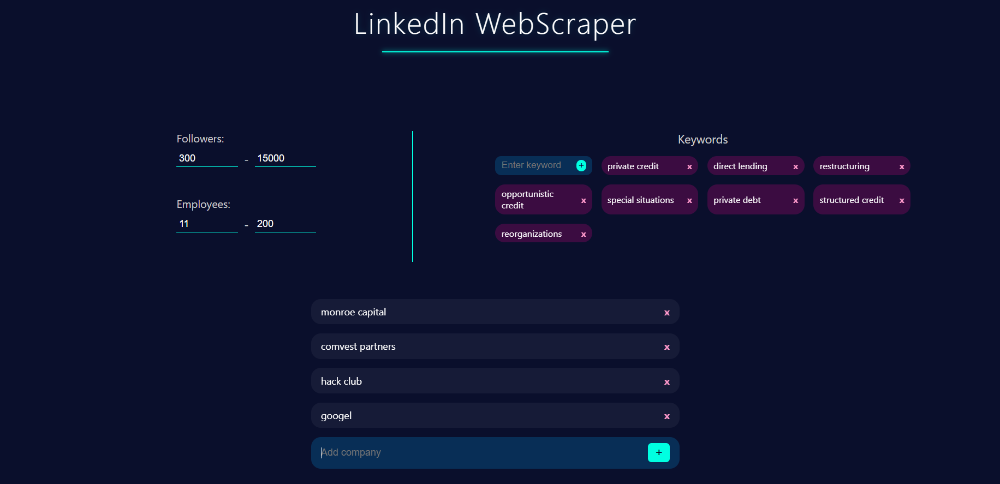
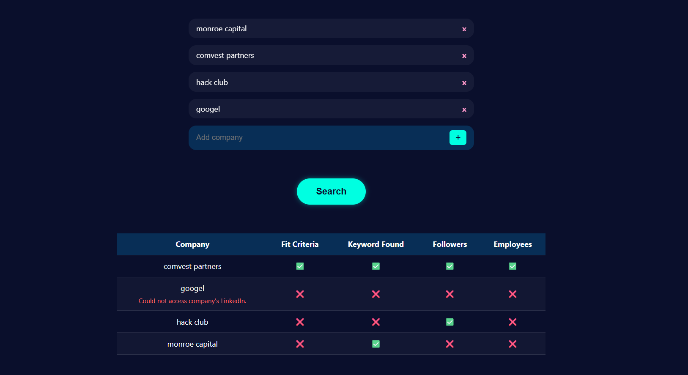

# LinkedIn WebScraper

An app that scrapes LinkedIn for company's information. User inputs their list of criteria that a company needs to have, then add up to 5 companies for the website to scrape. The website will return a list of whether the company passed the set criteria. [Go to Website ->](https://linkedin-webscraper-1.onrender.com/)

## How to Use
Add at least one criteria. You can set the minimum and maximum followers the company has on LinkedIn, or number of employees listed on LinkedIn. You can also set keywords that a company needs to have in their LinkedIn profile. Once this is set, add 1-5 companies you want to check. Pressing "search" will send data to the webscraper. After data has been processed, the website will give you a chart to show which companies passed your criteria, and which ones didn't.

Depends on the number of companies you're searching for, the app might take a few minutes to load the data.

## How It Was Made
This website was made originally by Thuc Chi Do. ([thucchi-cs](https://github.com/thucchi-cs))

This website uses Python's Flask, HTML, CSS, And JavaScript. The website also utilizes Selenium to scrape LinkedIn.

## Why It Was Made
The main purpose of this website was to allow me to understand how a webscraper or a web driver works. This is my first project with such things. It is also a good tools for people looking for companies but don't want to manually look in each company's page.